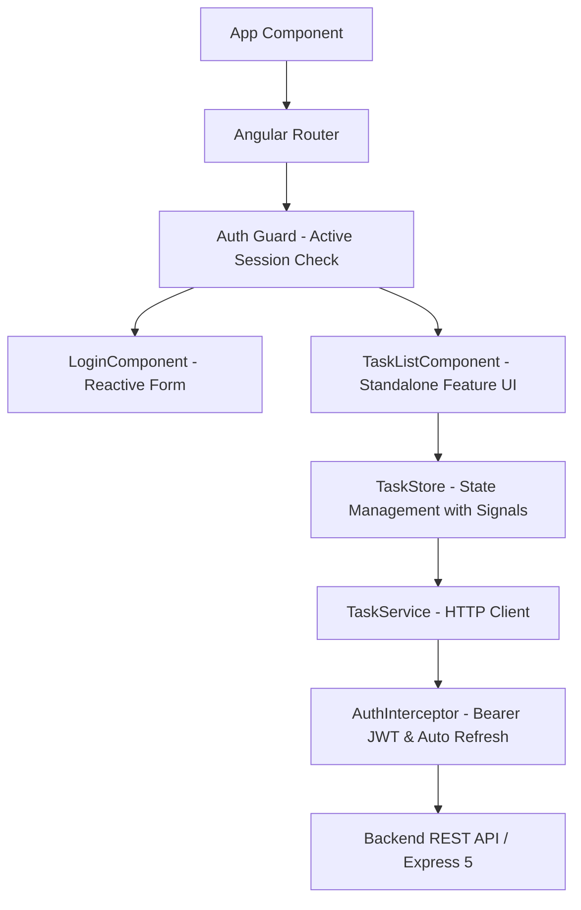

# Arquitectura Frontend - Iris To-Do App (Angular 21)

## Resumen de la Solución

Aplicación web desarrollada en **Angular 21** con **TypeScript**, utilizando el paradigma de **Componentes Standalone**, **Angular Signals** para el manejo de estado reactivo local/global, **Reactive Forms** y estilos optimizados con **Vanilla SCSS**.



---

## Patrón de Arquitectura

El proyecto adopta una **Arquitectura Guiada por Características y Dominios (Feature-Driven Architecture)** recomendada para aplicaciones Angular de nivel Senior:

```text
frontend/src/app/
└── features/
    ├── auth/
    │   ├── components/login/
    │   ├── guards/
    │   ├── interceptors/
    │   ├── models/
    │   └── services/
    └── tasks/
        ├── components/task-list/
        ├── models/
        └── services/
```

1. **Features (`src/app/features/`):** Módulos de dominio independientes (`auth`, `tasks`), cada uno con sus subcarpetas simétricas:
   - `components/`: Componentes UI Standalone con sus 4 archivos estándar (`.ts`, `.spec.ts`, `.html`, `.scss`).
   - `guards/`: Guardias de rutas (`authGuard`).
   - `interceptors/`: Interceptores HTTP (`authInterceptor`).
   - `models/`: Modelos e interfaces de TypeScript.
   - `services/`: Servicios HTTP (`TaskService`, `AuthService`) y gestores de estado (`TaskStore`).

---

## Manejo de Estado (Signals & TaskStore)

- **Signals de Angular 21:** Reemplazan el estado imperativo por valores reactivos finos (`signal`, `computed`).
- **TaskStore (`src/app/features/tasks/services/task.store.ts`):** Servicio reactivo que expone las señales `tasks`, `trash`, `loading`, `error`, `status`, `search`, `sort`, `page`, `pendingCount` y `completedCount`.
- **Actualizaciones Optimistas:** Modifica el estado visual inmediatamente ante acciones del usuario y realiza rollback automático si la llamada a la API REST falla.

---

## Características de UX/UI

- **Modo Claro / Modo Oscuro:** Persistido dinámicamente en `localStorage` mediante atributos `data-theme` en CSS Root.
- **Drag & Drop Reordenamiento:** Integración nativa con `@angular/cdk/drag-drop` y sincronización directa de posiciones.
- **Papelera y Soft Delete:** Gestión de tareas eliminadas lógicamente con posibilidad de restauración o borrado definitivo.
- **Microinteracciones:** Transiciones fluidas, badges de prioridad y categoría, e indicadores de tareas vencidas o próximas a vencer.
